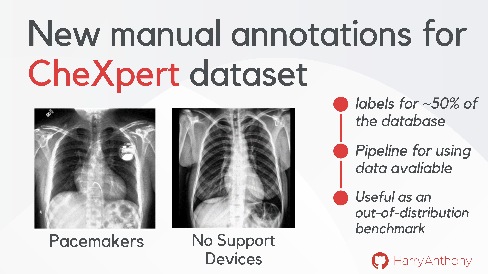

# On the use of Mahalanobis distance for out-of-distribution detection with neural networks for medical imaging

### :newspaper: Updates

25 September 2023:
* All code and manual annotations are now fully available!
9 September 2023:
* Pre-print of the paper is now available on Arxiv, which can be found here [1].

### Introduction
This repository provides several contributions:
*  A collection of out-of-distribution (OOD) detection methods that can be applied to pre-trained neural networks, including Mahalanobis distance-based OOD detectors at different depths of the network - studied in our work [1].
*  Manual annotations for ~50% of the CheXpert database, labelling if a frontal X-ray scan contains a pacemaker or no support device (labels for 100% of the dataset coming soon). I hope this will be a valuable OOD detection benchmark for the community. 





Contained within this repository is the code that corresponds with the paper [1]. The work studies OOD detection methods that can be applied on pre-trained deep neural networks which are trained on a specific task of interest (i.e disease classification) - known as _post-hoc_ OOD detection methods. This code also enables analysis into how the performance of Mahalanobis distance-based OOD detection changes based on factors such as where the features are extracted in the network or the form of the OOD artefact. The code can be used to demonstrate the performance of using multiple Mahalanobis distance-based detectors at different depths of the network (multi-branch Mahalanobis), which is studied in paper [1]. I hope this work will inspire future works into OOD detection for medical image analysis. If these ideas, code or dataset helped influence your research, please cite the following paper (bibtex given at bottom of readme).

[1] **Harry Anthony**, Konstantinos Kamnitsas “[On the use of Mahalanobis distance for out-of-distribution detection with neural networks for medical imaging](https://arxiv.org/abs/2309.01488)”, *UNSURE 2023 workshop at MICCAI 2023*.


### Table of Contents
* [1. Method overview](#1-method-overview)
* [2. Requirements](#2-requirements)
* [3. Usage Instructions](#3-usage-instructions)
	* [a. Training models](#a-training-models)
	* [b. Manual annotations for CheXpert](#b-manual-annotations-for-chexpert)
	* [c. Creating synthetic artefacts](#c-creating-synthetic-artefacts)
	* [d. Applying OOD detection](#d-applying-ood-detection)
* [4. Citation](#4-citation)
* [5. Acknowledgements](#5-acknowledgements)
* [5. License](#5-license)


### 1. Method overview
An out-of-distribution (OOD) detection method which has gained a lot of research interest is measuing the distance of a test input to the training data in the network's latent space. The distance metric used is typically *Mahalanobis distance*. Using a feature extractor $\mathcal{F}$ (which is typically a section of the DNN), the feature maps after a module in the network can be extracted $h(\mathbf{x}) \in \mathbb{R}^{D \times D \times M}$, where the maps have size $D \times D$ with $M$ channels. The means of these feature maps can be used to define an embedding vector $\mathbf{z}(\mathbf{x}) \in \mathbb{R}^{M} = \frac{1}{D^2} \sum_D \sum_D \mathbf{h} (\mathbf{x})$. The mean $\mathbf{\mu_y}$ and covariance matrix $\Sigma_y$ of the embedding vector for each class in the training data $(\mathbf{x},y) \sim \mathcal{D}_{\text {train}}$ can then be calculated.

The Mahalanobis distance $d_{\mathcal{M}_y}$ between the vector $\mathbf{z}(\mathbf{x}^\*)$ of a test data point $\mathbf{x}^\*$ and the training data of class $y$ can be calculated as a sum over M dimensions. 
```math
d_{\mathcal{M}_y}(\mathbf{x}^*) = \sum_{i=1}^M ( \mathbf{z}(\mathbf{x^*}) - \mathbf{\mu_y}) \Sigma_y^{-1}  ( \mathbf{z}(\mathbf{x^*}) - \mathbf{\mu_y})
```
The Mahalanobis score is defined as the minimum Mahalanobis distance between the test data point and the class centroids of the training data, which can be used as an OOD scoring function $\mathcal{S}$.
```math
\mathcal{S}_{\text {Mahal. Score}}(\mathbf{x}^*) = - \min_{y \in \mathcal{Y}} \{ d_{\mathcal{M}_y}(\mathbf{x}^*) \}
```
where the negative sign is used to stay consistent with the convention of having a higher scoring function for ID than OOD inputs. OOD detection can be viewed as a binary classification problem, labelling an input $\mathbf{x}$ as OOD when the scoring function $\mathcal{S}(\mathbf{x},f)$ is below a threshold $\lambda$, and ID if it is above. Such a scoring function should identify if the input is from a different distribution to $\mathcal{D}_{\text {train}}$. 
```math
G_{\lambda}(\mathbf{x})= \begin{cases}\text { OOD } & \text { if } \mathcal{S}(\mathbf{x}) \leq \lambda \\ \text { ID } & \text { if } \mathcal{S}(\mathbf{x}) > \lambda \end{cases}
```


 

**Figure 1**: (Left) Method to extract embeddings after a network module. (Right) Mahalanobis score $d_{\mathcal{M}}$ of an input to the closest training class centroid. Figure is from [1].

This research studies the best practises for the application of Mahalanobis distance for OOD detection. Our results in [1] highlight that different OOD artefacts are optimally detected at different depths of the network, which motivates using multiple OOD detectors operating at different depths of a network. To study this further, the network was divided into sections, split by successive downsampling operations, which we refer to as _branches_. The Mahalanobis scores measured after every module in a branch $\ell \in L_b$, where $L_b$ is the set of modules in branch b, is added together to produce a scoring function at each branch of the network. Before the summation, each of the Mahalanobis scores after every module are normalised by using the means and standard deviatations of the Mahalanobis scores of the training data (see [1] for details). This method was given the name **Multi-Branch Mahalanobis (MBM)** and it results in several OOD detectors at different depths of the network.
```math
\mathcal{S}_{\text {MBM, branch-b}}(\mathbf{x}^*) = \sum_{\ell \in L_b} \frac{d_{\mathcal{M}}^\ell (\mathbf{x}) - \mu_b^\ell}{\sigma_b^\ell}
```

 
**Figure 2**: AUROC (mean of 5 folds) for Mahalanobis score at different modules of ResNet18 for unseen pacemaker (green) and unseen sex (pink) OOD tasks, see [1] for details. The figure shows the modules in each branch for Multi-Branch Mahalanobis (MBM) with grey brackets. Figure is from [1].

### 2. Requirements
 
#### a. Installation requirements
The system requires the following (latest version tested):
- [Python](https://www.python.org/downloads/): Developed using Python 3 (3.9.12).
- [numpy](http://www.numpy.org/) : Package for analysing and using arrays (1.24.2).
- [scipy](http://www.scipy.org/) : Scientific packages used for image transformations (1.9.3).
- [PyTorch](https://pytorch.org/) : Library for deep learning (1.13.0).
- [Torchvision](https://pytorch.org/vision/stable/index.html#module-torchvision) : Library used for datasets, transforms, and models (0.14.0).
- [pandas](https://pandas.pydata.org/) : Data manipulation and analysis library (1.5.2).
- [Pillow](https://pillow.readthedocs.io/en/stable/): Library for image processing (9.2.0).
- [Scikit-image](https://scikit-image.org/): Library for image processing and adaptation (0.19.3).

The project can be cloned using
```
$ git clone https://github.com/HarryAnthony/private_mahal_score/
```

#### b. Data requirements
This research was completed on the CheXpert dataset [2], a multi-label dataset of chest X-rays. Therefore, to run the example code please download the `CheXpert-v1.0-small` dataset and place it in the folder `data`. The default settings used for the datasets are described in the `source/config/chexpert.py` file.


### 3. Usage instructions

#### a. Training models
Training models using the settings that were used for our project can be achieved using the following code:
```
python3 training.py [-h] [--setting SETTING] [--lr LR] [--net_type NET_TYPE] [--depth DEPTH] [--widen_factor WIDEN_FACTOR] [--dropout DROPOUT] [--act_func_dropout ACT_FUNC_DROPOUT]
                   [--cuda_device CUDA_DEVICE] [--seed SEED] [--dataset_seed DATASET_SEED] [--batch_size BATCH_SIZE] [--dataset DATASET] [--allow_repeats ALLOW_REPEATS] [--verbose VERBOSE]
                   [--Optimizer OPTIMIZER] [--Scheduler SCHEDULER] [--save_model SAVE_MODEL] [--max_lr MAX_LR] [--act_func ACT_FUNC] [--class_selections CLASS_SELECTIONS]
                   [--demographic_selections DEMOGRAPHIC_SELECTIONS] [--dataset_selections DATASET_SELECTIONS] [--train_val_test_split_criteria TRAIN_VAL_TEST_SPLIT_CRITERIA] [--fold FOLD]
                   [--label_smoothing LABEL_SMOOTHING]
```
The arguments of the file allow for a lot of autonomy in controlling the how the model is trained. For training models on the CheXpert dataset, there are pre-made settings which can be used with the `--setting` argument:
* `setting1`: Train a model to classify between Positive Cardiomegaly and Positve Pnuemothorax X-ray scans, with patient IDs kept seperate in the test:val:test sets.
* `setting2`: Train a model to classify between Positive Pleural Effusion and Negative Pleural Effision X-ray scans with no visible support devices (see sec 3.b), with patient IDs kept seperate in the test:val:test sets.
* `setting3`: Train a model to classify between Positive Pleural Effusion and Negative Pleural Effision X-ray scans of male only scans with no visible support devices (see sec 3.b), with patient IDs kept seperate in the test:val:test sets.

If the `--setting` argument is not one of the above, then the arguments will be used to select the data to train the model. The configurations for each dataset are given in the `source/config` directory. The configurations of each of the models that are trained using this file are saved to the file `checkpoint/model_list.csv`.


#### b. Manual annotations for CheXpert
In this research, we manually annotated ~50% of the frontal X-rays in the CheXpert dataset (labels for 100% coming soon!) into four categories: *no support device*, *pacemaker*, *other support device* (i.e. no pacemaker), *uncertain*. The aim was to create a clean and reliable OOD evaluation benchmark for medical imaging: The *no support device* class is a set of images that can be used as In-Distribution set for training a model, while the images of *pacemaker* class, which contain a visually-distinct image pattern, can be used as the OOD test set - enabling analyses of the performance of OOD detection methods on a real OOD artefact. As a contribution of this work, we make these annotations publicly available here, and hope they will be useful for assessment of OOD methods in future works by the community. Please cite this work if you use this data in your research.

The annotations are given by the following textfiles: 
* `pacemaker.txt` : X-ray scans with a visible pacemaker device.
* `other_support_device.txt` : X-ray scans with a visible support device (lines, PICC, tube, valve, catheter, hardware, arthroplast, plate, screw, cannula, coil, mediport) visibly obscuring the chest, but not including a visible pacemaker device.
* `no_support_device.txt` : X-ray scans without any visible support device (nor pacemaker).
* `uncertain.txt` : Low-quality X-ray scans in which it is difficult to dissern which of the above categories the image belongs.

These files contain the `Path` to the image, which means selections on the dataset can be used in the following way:
```
pacemaker_list = np.loadtxt("pacemaker.txt",dtype=str)
pacemaker_list = ['CheXpert-v1.0-small/'+str(element) for element in pacemaker_list ]
pacemaker_data =  dataset['Path'].isin(pacemaker_list)]
```

Creating this set of annotations was necessary to create a reliable OOD evaluation because we found the original class *support devices* of CheXpert contained some label noise (as it's made by an NLP model) and contained a heterogeneous set of devices (as opposed to our *pacemaker* class), which complicated analysis of OOD patterns. If you find any issues, please let us know so they can be addressed.

**DISCLAIMER**: These annotations were made by author Harry Anthony (PhD candidate in Engineering Science) based on visual inspection, and were **not validated by medical experts**. This data is for **research purposes only**.


**Figure 3**: Visualisation of the manual annotations made for ~50% of the frontal scans for the CheXpert dataset, giving examples for the four different labels used for our annotations. These annotations are available in the _data_ directory.


#### c. Creating synthetic artefacts
This repository contains a collection of classes (`make_synthetic_artefacts.py`) which enable the addition of synthetic artefacts to images. This tool is designed to integrate into the torchvision transforms library, making it easy to augment your image datasets with synthetic artefacts. These classes can be used to generate synthetic artefacts of various shapes and textures:


 

**Figure 4**: Visualisation of the different shapes (top row) and textures (bottom row) of synthetic artefacts which can be created with `make_synthetic_artefacts.py`. This code can be used to study how different OOD artefacts interact with pre-trained neural networks.


These can be integrated with `torchvision.transforms` in the following way:
```
import torchvision.transforms as T
transformations = T.Compose([T.Resize((224,224)),
            T.ToTensor(),
            T.RandomErasing_square(p=1), #Square synthetic artefact added to every image (probability = 1).
            lambda x: x.expand(3,-1,-1)])})
```
It can also be used in conjunction with the function `modify_transforms` in `make_synthetic_artefacts.py` which enables the addition of synthetic artefact transformations to the list of transformations for a dataloader without requiring the original list to be re-defined. I hope this becomes a useful tool for studying how neural networks interact with different OOD artefacts, as a means of improving OOD detection methods.


#### d. Applying OOD detection
Given a seed of the experiment, saved in the file `checkpoint/model_list.csv`, OOD detection methods can be applied using the file:
```
python 3 evaluate_OOD_detection_method.py [-h] [--method METHOD] [--cuda_device CUDA_DEVICE] [--batch_size BATCH_SIZE] [--verbose VERBOSE] [--seed SEED] [--ood_class_selections OOD_CLASS_SELECTIONS]
               [--ood_demographic_selections OOD_DEMOGRAPHIC_SELECTIONS] [--ood_dataset_selections OOD_DATASET_SELECTIONS] [--ood_train_val_test_split_criteria OOD_TRAIN_VAL_TEST_SPLIT_CRITERIA]
               [--ood_type OOD_TYPE] [--ood_dataset OOD_DATASET] [--filename FILENAME] [--temperature TEMPERATURE] [--noiseMagnitude NOISEMAGNITUDE]
               [--MCDP_samples MCDP_SAMPLES] [--deep_ensemble_seed_list DEEP_ENSEMBLE_SEED_LIST] [--save_results SAVE_RESULTS] [--plot_metric PLOT_METRIC] [--return_metrics RETURN_METRICS]
               [--evaluate_ID_accuracy EVALUATE_ID_ACCURACY] [--evaluate_OOD_accuracy EVALUATE_OOD_ACCURACY] [--mahalanobis_layer MAHALANOBIS_LAYER]
```
The argument `--ood_type` can be one of the following:
* `different_class` : use an unseen class from the same dataset as the ID test cases. In conjunction with sec. 3.a, there are three pre-made settings to use: 
	* `setting1`: Use unseen X-ray scans containing a fracture as OOD test cases.
	* `setting2`: Use X-ray scans only containing pacemaker devices as OOD test cases.
	* `setting3`: Use X-ray scans of female patients (unseen sex) with no support devices as OOD test cases.
	If the setting is not one of the above, then the OOD dataset selections will be made using the arguments.
* `synthetic` : adds a synthetic artefact using `Image_augmentations.py` to the ID test dataset to be the OOD test cases.
* `different_database` : use in conjunction with argument `--ood_dataset` to use another dataset as the OOD test cases.

Once the OOD test set is decided, the OOD detection method can be chosen with the `--method` argument, where the choices are: MCP, MCDP, ODIN, deepensemble, mahalanobis and MBM. Each method will print the AUROC and AUCPR of the scoring function. To save the outputs, use the function `--save_results` which will save the scoring function for the ID cases and the OOD cases as well as the AUROC and AUCPR for each method.

#### Using Mahalanobis score and MBM
Using the argument `--method mahalanobis` will calculate the Mahalanobis score and use it as the scoring function for OOD detection. The argument `--mahalanobis_module` can be used to control which modules of the network are used, the options are:
* A single value (int) will calculate the Mahalanobis score from the embeddings after that module of the network.
* An array of values will calculate the Mahalanobis score from embeddings after multiple modules of the network.
* The string 'all' can be used to calculate the Mahalanobis score at all modules of the network.


If more than one module is selected, the argument `--feature_combination` decides whether to keep the scoring function of each module seperate and calculate an individual AUROC and AUCPR for every module (`--feature_combination False`) or whether to combine the distances of the modules selected in order to have one scoring function for OOD detection (`--feature_combination True`).
Using the argument `--method MBM` will select the modules for each *branch* (see sec.1) and will combine them using feature combination. Note that MBM is currently only avaliable for models ResNet18 and VGG16_bn, but additional models can be added by extending the *mahalanobis_module_dict* in `source/methods/mahalanobis.py`.


### 4. Citation
I hope this work is useful for further understanding how neural networks behave when encountering an OOD input. If you found this work useful or have any comments, do let me know. Please email me your feedback or any issues to: **harry.anthony@eng.ox.ac.uk**.

When citing this research, please use the bibTex:
```
@misc{anthony2023use,
      title={On the use of Mahalanobis distance for out-of-distribution detection with neural networks for medical imaging}, 
      author={Harry Anthony and Konstantinos Kamnitsas},
      year={2023},
      eprint={2309.01488},
      archivePrefix={arXiv},
      primaryClass={cs.CV}
}
```


### 5. Acknowledgments
I would like to acknowlegde the work done by Christoph Berger [3], as their project code was very helpful for my project.

[2]: Irvin, J., Rajpurkar, P., Ko, M., Yu, Y., et al.: Chexpert: A large chest radiograph dataset with uncertainty labels and expert comparison. In: Proceedings of the AAAI conference on artificial intelligence. vol. 33, pp. 590–597 (2019)

[3]: Berger, Christoph, Magdalini Paschali, Ben Glocker, and Konstantinos Kamnitsas. "Confidence-based Out-of-Distribution Detection: A Comparative Study and Analysis." arXiv preprint arXiv:2107.02568 (2021)


### 5. License

MIT License

Copyright (c) 2023 Harry Anthony

Permission is hereby granted, free of charge, to any person obtaining a copy
of this software and associated documentation files (the "Software"), to deal
in the Software without restriction, including without limitation the rights
to use, copy, modify, merge, publish, distribute, sublicense, and/or sell
copies of the Software, and to permit persons to whom the Software is
furnished to do so, subject to the following conditions:

The above copyright notice and this permission notice shall be included in all
copies or substantial portions of the Software.

THE SOFTWARE IS PROVIDED "AS IS", WITHOUT WARRANTY OF ANY KIND, EXPRESS OR
IMPLIED, INCLUDING BUT NOT LIMITED TO THE WARRANTIES OF MERCHANTABILITY,
FITNESS FOR A PARTICULAR PURPOSE AND NONINFRINGEMENT. IN NO EVENT SHALL THE
AUTHORS OR COPYRIGHT HOLDERS BE LIABLE FOR ANY CLAIM, DAMAGES OR OTHER
LIABILITY, WHETHER IN AN ACTION OF CONTRACT, TORT OR OTHERWISE, ARISING FROM,
OUT OF OR IN CONNECTION WITH THE SOFTWARE OR THE USE OR OTHER DEALINGS IN THE
SOFTWARE.


