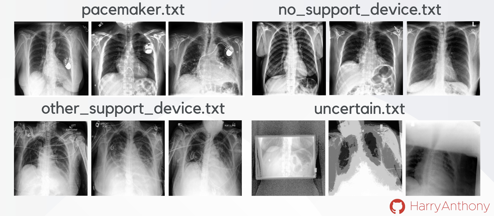

#### Data requirements
Please download the [CheXpert-v1.0-small](https://stanfordmlgroup.github.io/competitions/chexpert/) dataset and place it in this directory. 

#### Accessing manual annotations for CheXpert
A significant contribution of this paper was manually annotation of ~50% of the lateral X-ray scans of the CheXpert dataset (labels of 100% incoming) into four categories, given by four textfiles: 
* `pacemaker.txt` : X-ray scans with a visible pacemaker device.
* `no_support_device.txt` : X-ray scans with a visible support devices, using the definition for support devices given by CheXpert [2].
* `support_devices.txt` : X-ray scans with a visible support device, but not including a visible pacemaker device.
* `uncertain.txt` : Low-quality X-ray scans in which it is difficult to dissern which of the above categories the image belongs.
These manual annotations were done because CheXpert's annotations are *sub-optimal*. These files contain the `Path` to the image, which means selections on the dataset can be used in the following way:
```
pacemaker_list = np.loadtxt("pacemaker.txt",dtype=str)
pacemaker_list = ['CheXpert-v1.0-small/'+str(element) for element in pacemaker_list ]
pacemaker_data =  dataset['Path'].isin(pacemaker_list)]
```
I hope that this will become a useful baseline  for OOD detection (for example, training a model on images with no support devices, and using the pacemaker dataset as an OOD test set). If you use these datasets in your research, please cite this work.



**Figure 3**: Visualisation of the four different labels used when labelling the CheXpert dataset, which are available in the _data_ directory.

